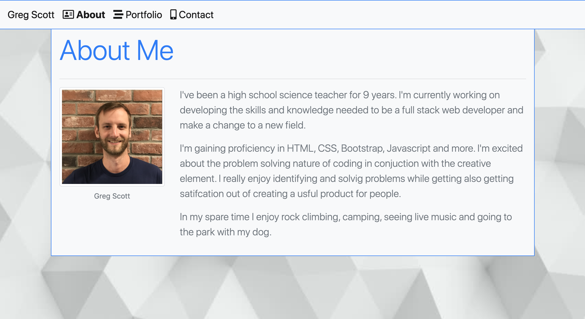
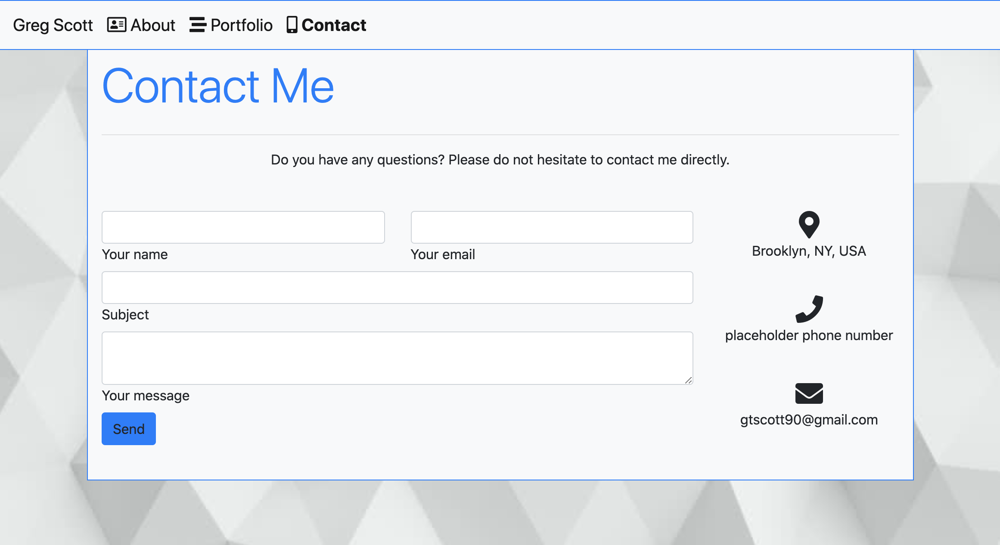
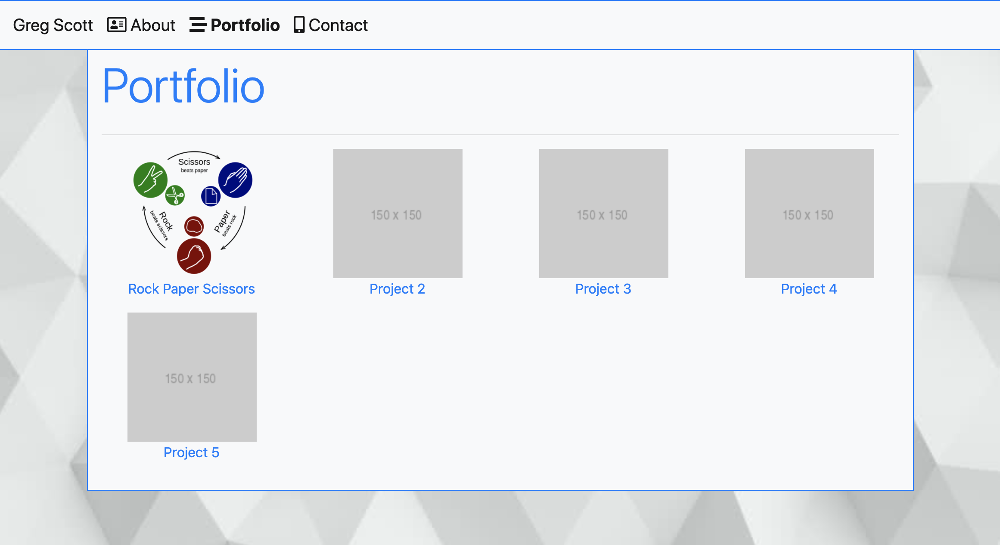

# Responsive Personal Portfolio

## Description

My goal was to create a resonsive we application that renders well on a variety of devices and window or screen sizes. This is the beginning of my personal portfolio that includes an about me seciton, links to my project, and a contact me page. I plan to continue to add to it as I progress through the bootcamp. 

### Usage
This portfolio can be a way that potential employers can get to know me and sample my work to better understand my skillset and professional goals. 

### Screenshots

### Links
Link to github repository: https://github.com/gtscott90/personal-portfolio 
Link to deployed application: https://gtscott90.github.io/personal-portfolio/index.html 

